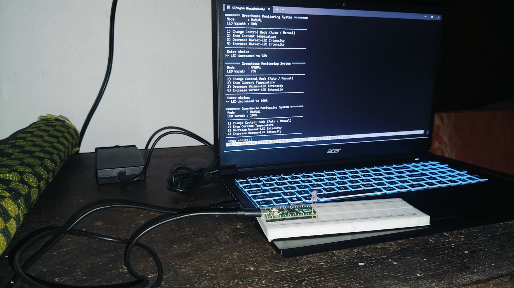
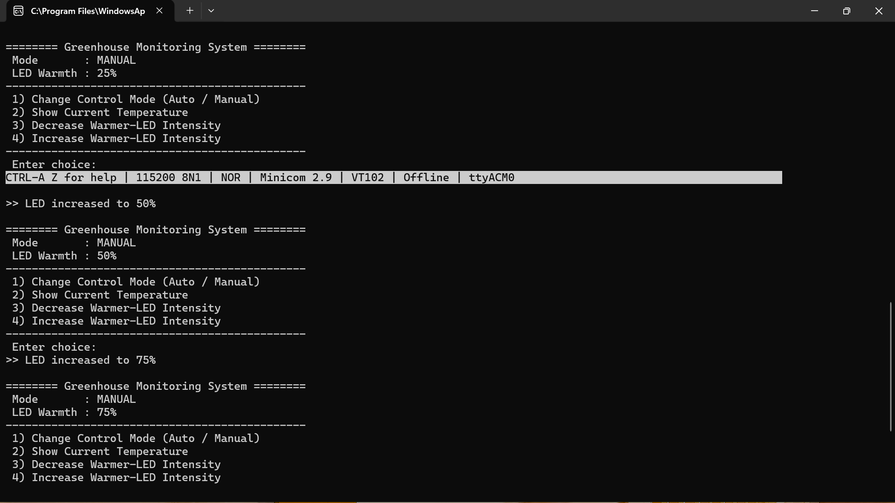
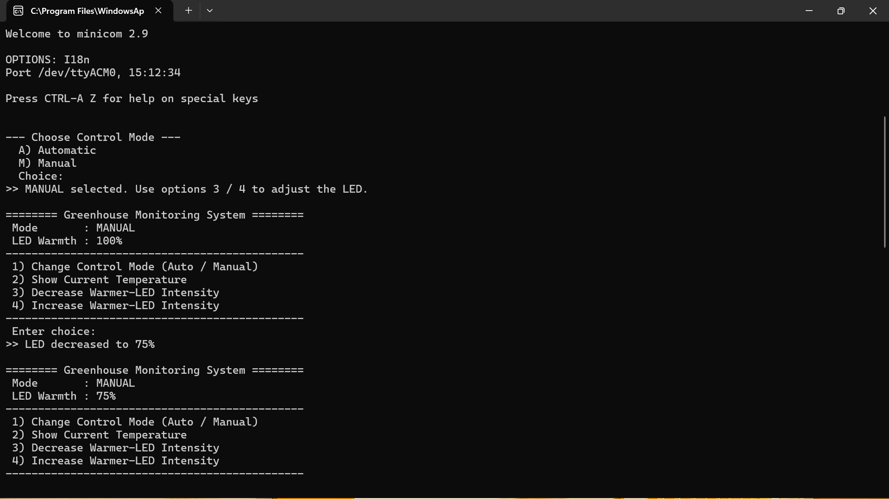

# Greenhouse Monitoring System — Raspberry Pi Pico (RP2040)

A temperature-based greenhouse monitoring and warmer-LED control system developed using the **Raspberry Pi Pico (RP2040)** and the **Pico SDK**.

The system reads temperature from the RP2040's onboard temperature sensor, controls a warmer LED using **PWM**, and provides an interactive terminal interface through **USB CDC and hardware UART**. Two operating modes are supported:

* **Automatic Mode** — LED intensity is selected from the measured temperature.
* **Manual Mode** — LED intensity and temperature display are controlled through the UART terminal.

---

## Project Overview

This mini-project demonstrates the integration of:

**Temperature Sensing → Decision Logic → PWM Control → UART/USB User Interface**

The firmware continuously measures the RP2040 internal temperature sensor and maps the measured temperature to a predefined warmer-LED intensity.

| Temperature         | Warmer LED Intensity |
| ------------------- | -------------------: |
| `< 25 °C`           |             **100%** |
| `25 °C ≤ T < 27 °C` |              **50%** |
| `T ≥ 27 °C`         |              **25%** |

The terminal interface allows the user to switch between automatic and manual control, view the current temperature in Celsius or Fahrenheit, and adjust the LED intensity manually.

> **Note:** The onboard RP2040 temperature sensor measures the chip's internal die temperature rather than the ambient greenhouse air temperature. For a real greenhouse deployment, an external sensor such as a DHT22, DS18B20, or TMP36 would be more appropriate.

---

## Features

### Temperature Monitoring

* Continuous temperature measurement using the RP2040 onboard ADC temperature sensor.
* Temperature display in both **°C** and **°F**.
* Eight sensor samples are averaged to improve reading stability.

### Automatic Temperature Control

The warmer LED intensity is selected automatically according to the configured temperature thresholds.

```text
Temperature < 25 °C
        │
        └──► LED = 100%

25 °C ≤ Temperature < 27 °C
        │
        └──► LED = 50%

Temperature ≥ 27 °C
        │
        └──► LED = 25%
```

### Manual Control

In manual mode, the user can:

* Display the current temperature.
* Display temperature in Celsius.
* Display temperature in Fahrenheit.
* Decrease warmer-LED intensity.
* Increase warmer-LED intensity.
* Return to the main menu.

### Interactive Terminal

The system provides a menu through **USB CDC and hardware UART**, allowing the firmware to be operated from a serial terminal such as **MiniCom**.

---

## Hardware Used

| Component            | Purpose / Notes                     |
| -------------------- | ----------------------------------- |
| Raspberry Pi Pico    | RP2040 development board            |
| LED (any colour)     | Warmer indicator                    |
| 220 Ω resistor       | LED current limiting                |
| Breadboard           | Prototype assembly                  |
| Micro-USB data cable | Programming and USB communication   |
| Host laptop          | Windows 11 with WSL2 / Ubuntu 24.04 |

### Temperature Sensor

The project uses the **RP2040 onboard temperature sensor**, internally connected to **ADC channel 4**.

For an actual greenhouse system, the onboard sensor should be replaced with an external temperature sensor capable of measuring the surrounding air temperature.

---

## Wiring

The warmer LED is connected to **GPIO15** and controlled using PWM.

```text
Raspberry Pi Pico

GPIO15 ─────► 220 Ω ─────► LED Anode (+)
GND    ──────────────────► LED Cathode (-)
```

| Pico Pin | Connection                 |
| -------- | -------------------------- |
| GPIO15   | 220 Ω resistor → LED anode |
| GND      | LED cathode                |

The PWM configuration uses approximately **125 kHz**, allowing smooth LED dimming.

---

## Software Stack

| Component             | Version / Configuration    |
| --------------------- | -------------------------- |
| Pico SDK              | `~/pico-sdk`               |
| ARM GCC               | `arm-none-eabi-gcc 13.2.1` |
| CMake                 | `≥ 3.13`                   |
| Operating Environment | WSL2                       |
| Linux Distribution    | Ubuntu 24.04               |
| Host OS               | Windows 11                 |
| USB Passthrough       | `usbipd-win v4.x`          |
| Serial Terminal       | MiniCom                    |

---

## Project Structure

```text
Greenhouse_Monitor/
├── CMakeLists.txt
├── greenhouse_monitor.c
├── pico_sdk_import.cmake
├── README.md
└── screenshots/
    ├── hardware.jpg
    ├── Increased.png
    ├── Decreased.png
    └── overall(auto).png
```

---

## System Workflow

```text
            ┌──────────────────────┐
            │   RP2040 Temperature │
            │      Sensor (ADC4)   │
            └──────────┬───────────┘
                       │
                       ▼
            ┌──────────────────────┐
            │ Temperature Reading  │
            │ + Sample Averaging   │
            └──────────┬───────────┘
                       │
             ┌─────────┴─────────┐
             │                   │
             ▼                   ▼
     Automatic Mode          Manual Mode
             │                   │
             ▼                   ▼
    Temperature Mapping     UART Menu Control
             │                   │
             └─────────┬─────────┘
                       │
                       ▼
              ┌────────────────┐
              │ PWM LED Control│
              │    GPIO15      │
              └────────────────┘
```

---

## Implementation Details

### 1. Temperature to LED Mapping

The automatic control logic is implemented as a simple temperature-to-intensity mapping:

```c
static int auto_intensity_for_temp(float t) {
    if (t < TEMP_LOW_C)  return 100;   // below 25 °C
    if (t < TEMP_HIGH_C) return 50;    // 25 – 27 °C
    return 25;                          // 27 °C and above
}
```

This separates the temperature decision logic from the LED control layer.

---

### 2. Reading the Onboard Temperature Sensor

The RP2040 internal temperature sensor is connected to **ADC channel 4**.

The conversion used in the firmware is:

```text
T = 27 - (V - 0.706) / 0.001721
```

where:

```text
V = raw × 3.3 / 4096
```

Eight ADC samples are averaged before the temperature is used by the control logic.

---

### 3. PWM LED Control

The warmer LED intensity is controlled through PWM.

```c
static void led_set_intensity(int percent) {
    uint slice = pwm_gpio_to_slice_num(LED_PIN);
    uint chan  = pwm_gpio_to_channel(LED_PIN);
    uint level = (percent * PWM_WRAP) / 100;
    pwm_set_chan_level(slice, chan, level);
}
```

The PWM wrap value is set to **1000**, so the duty-cycle level corresponds approximately to:

```text
0     → 0%
250   → 25%
500   → 50%
750   → 75%
1000  → 100%
```

---

### 4. Interactive Menu

The main firmware loop provides a UART/USB terminal menu for user interaction.

```text
========================================
      Greenhouse Monitoring System
========================================

Mode       : MANUAL
LED Warmth : 100%
----------------------------------------
1) Change Control Mode (Auto / Manual)
2) Show Current Temperature
3) Decrease Warmer-LED Intensity
4) Increase Warmer-LED Intensity
----------------------------------------
Enter choice:
```

In automatic mode, the terminal continuously reports temperature and LED intensity.

```text
AUTOMATIC mode active.
Press any key to return to the main menu.

Temp: 35.16 C | 95.28 F | Warmer LED: 25%
Temp: 34.69 C | 94.44 F | Warmer LED: 25%
Temp: 34.63 C | 94.33 F | Warmer LED: 25%
```

A non-blocking input method is used so that terminal output can continue while the firmware checks for a keypress.

```c
int ch = getchar_timeout_us(0);
if (ch != PICO_ERROR_TIMEOUT) {
    /* exit auto mode */
}
```

---

## CMake Configuration

The application links the Pico standard library together with the ADC and PWM hardware libraries.

```cmake
target_link_libraries(greenhouse_monitor
    pico_stdlib
    hardware_adc
    hardware_pwm
)
```

Both serial backends are enabled:

```cmake
pico_enable_stdio_usb(greenhouse_monitor 1)
pico_enable_stdio_uart(greenhouse_monitor 1)
```

With both backends enabled, standard `printf()` output can be routed through the configured USB CDC and UART interfaces.

---

## Build Instructions

The Pico SDK is assumed to be installed at:

```bash
~/pico-sdk
```

Set the SDK path:

```bash
export PICO_SDK_PATH=$HOME/pico-sdk
```

Build the project:

```bash
cd ~/PICO_Projects/Greenhouse_Monitor
mkdir -p build
cd build

cmake ..
make -j4
```

The generated firmware file is:

```text
greenhouse_monitor.uf2
```

---

## Flashing the Firmware

### 1. Enter BOOTSEL Mode

1. Disconnect the Raspberry Pi Pico.
2. Hold the **BOOTSEL** button.
3. Connect the USB cable while holding BOOTSEL.
4. Release the button.

Windows should detect a drive named:

```text
RPI-RP2
```

### 2. Copy the UF2 File

Copy:

```text
greenhouse_monitor.uf2
```

from the build directory to the **RPI-RP2** drive.

For example, the file can be accessed through WSL using:

```text
\\wsl$\Ubuntu\...
```

or through the corresponding mounted Windows drive.

After the UF2 file is copied, the RPI-RP2 drive disappears and the firmware starts running.

---

## USB Re-Attachment and MiniCom

After flashing, the Pico can be attached back to WSL for terminal communication.

### Windows PowerShell

Run PowerShell as Administrator:

```powershell
usbipd list
```

Locate the Raspberry Pi Pico device (`2e8a:000a`) and note its **BUSID**.

Then attach it to WSL:

```powershell
usbipd attach --wsl --busid <BUSID>
```

### WSL

Check for the serial device:

```bash
ls /dev/ttyACM*
```

Expected device:

```text
/dev/ttyACM0
```

Start MiniCom:

```bash
minicom -b 115200 -o -D /dev/ttyACM0
```

---

## Terminal Operation

### Boot Screen

After the firmware starts, the terminal displays:

```text
========================================
 Greenhouse Monitoring System - Boot OK
========================================

Warmer LED on GPIO15 | Sensor: onboard ADC4
```

The main menu then appears.

### Manual Mode

The default menu provides four main operations:

```text
1) Change Control Mode (Auto / Manual)
2) Show Current Temperature
3) Decrease Warmer-LED Intensity
4) Increase Warmer-LED Intensity
```

Manual intensity adjustment is performed in **25% steps**.

Example:

```text
>> LED decreased to 75%
```

### Temperature Display

Selecting the temperature option displays both Celsius and Fahrenheit:

```text
>> Current Temperature:
     36.15 C
     97.07 F
```

### Automatic Mode

Selecting automatic control starts continuous monitoring:

```text
>> AUTOMATIC selected.

>> AUTOMATIC mode active.
>> Press any key to return to the main menu.

Temp: 35.16 C | 95.28 F | Warmer LED: 25%
Temp: 34.69 C | 94.44 F | Warmer LED: 25%
Temp: 34.63 C | 94.33 F | Warmer LED: 25%
```

Pressing any key returns to the main menu.

---

## Screenshots

### Hardware Setup

The hardware prototype with the Raspberry Pi Pico, warmer LED, current-limiting resistor, breadboard, and wiring.



### Increased Warmer-LED Intensity

MiniCom output showing the warmer LED intensity being increased through manual control.



### Decreased Warmer-LED Intensity

MiniCom output showing the warmer LED intensity being decreased through manual control.



### Automatic Mode — Overall Monitoring

MiniCom output showing the current temperature and automatically selected warmer-LED intensity.


---

## Important Observation

The RP2040 onboard sensor reports the **internal die temperature**, not the greenhouse air temperature.

During testing, the temperature was observed around **34–36 °C** at room conditions. As a result, the automatic controller remained at the **25% LED intensity** level because the measured value was already above 27 °C.

This behavior is consistent with the configured temperature mapping and the characteristics of the onboard sensor.

For a real greenhouse monitoring application, an external ambient-temperature sensor should be used.

---

## Challenges and Solutions

### Onboard Sensor Reads Die Temperature

The internal sensor measures the silicon die temperature, which is higher than typical room temperature.

**Effect:** Automatic mode can remain at 25% LED intensity.

**Practical solution:** Use an external ambient sensor such as DHT22 or DS18B20 for greenhouse deployment.

### Non-Blocking Key Detection

Automatic mode must print every second while still allowing the user to exit.

A blocking `getchar()` call would stop the periodic display. The implementation therefore uses:

```c
getchar_timeout_us(0)
```

This checks for input without blocking the main loop.

### Buffered Carriage Return / Line Feed

After entering a menu value and pressing Enter, `\r` or `\n` may remain in the input buffer.

The input buffer is drained after a valid menu command:

```c
while (getchar_timeout_us(1000) != PICO_ERROR_TIMEOUT) {
    /* drain */
}
```

### PWM Initialization Order

The PWM hardware must be initialized before setting the LED duty cycle.

The project initializes the LED/PWM interface before the first call to `led_set_intensity()`.

### Re-Flashing the Pico

Reprogramming requires entering **BOOTSEL mode** again.

The normal procedure is:

```text
Unplug → Hold BOOTSEL → Reconnect → Copy UF2
```

After flashing, the device is attached to WSL again using `usbipd`.

---

## Lessons Learned

This project demonstrates several useful embedded-system concepts:

* Separating temperature decision logic from PWM control simplifies testing and debugging.
* PWM provides a straightforward way to implement multiple LED intensity levels.
* Non-blocking serial input is important for interactive embedded applications.
* Internal MCU temperature sensing is useful for device-level monitoring but is not a substitute for ambient sensing.
* A previously configured WSL2 + Pico SDK + MiniCom environment can significantly simplify subsequent Pico projects.

---

## Future Enhancements

Possible extensions include:

* Replace the onboard sensor with **DHT22 / DS18B20** for ambient monitoring.
* Add **temperature hysteresis** around the switching points to reduce rapid LED changes.
* Add minimum and maximum temperature tracking.
* Add a buzzer alarm when the temperature exceeds a defined threshold.
* Store temperature measurements for historical analysis and graphing.
* Expand the UART menu with additional system information.

---

## Project Context

This project was developed as a Raspberry Pi Pico embedded-systems exercise demonstrating:

**ADC Temperature Measurement + PWM Control + USB CDC + UART + Interactive Menu**
